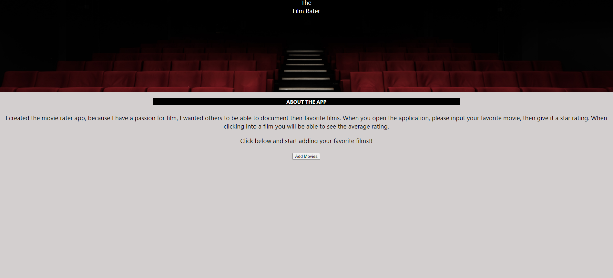
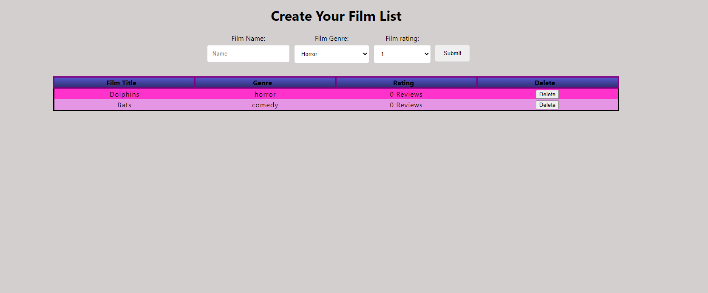

# Capstone_Sever

**[Movie Rater](https://movie-aftvtyh5k.vercel.app/)**

**Summary**

This application was built by a movie lover for movie lovers. Film has always been a passion for me and I hope this 
app brings you joy with an ability to document and rate your favorite movies. To use this application, click on add movies, then once inside the application you can enter a film and specify the genre. You can then submit the film and click into it to give it a detailed review. 

This Application was built using React,Node.js,PostgreSQL and Express.

API Documentation

GET /api/films
Returns an array of films that are in the database.

[
  {
    "id": 42,
    "namet": "Ghostbusters",
    "description": "This movie was great",
  }
]

▸ POST /api/images
A typical film submission is made as a POST request using a simple form submit. Th

A successful POST requires a Film name as well as a descriptino.

The submitted image must meet community guidelines and will be rejected with a status 400 if questionable content is detected by the Google Vision API.

If no submission could be found by submission_id, the server responds with a status 400.

